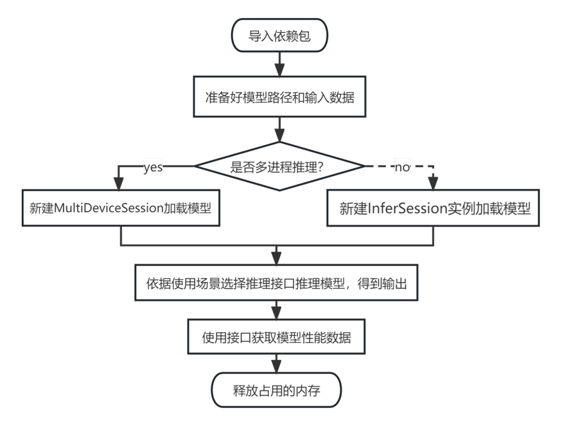

# ait benchmark interface python API使用指南
## benchmark API简介
  benchmark提供的python API可供使能基于昇腾硬件的离线模型(.om模型)推理。<br>

使用ait benchmark 提供的api需要安装`ais_bench`和`aclruntime`包。安装方法有：
- 1、参考[一体化安装指导](https://gitee.com/ascend/ait/blob/master/ait/docs/install/README.md)安装ait benchmark工具
- 2、依据需求，单独安装ais_bench包和aclruntime包([安装包获取地址](https://gitee.com/ascend/ait/blob/master/ait/components/benchmark/README.md#下载whl包安装))：

  ``` cmd
  # 安装aclruntime
  pip3 install ./aclruntime-{version}-{python_version}-linux_{arch}.whl
  # 安装ais_bench
  pip3 install ./ais_bench-{version}-py3-none-any.whl
  # {version}表示软件版本号，{python_version}表示Python版本号，{arch}表示CPU架构。
  ```
## interface python API 快速上手
### 整体流程图


### 导入依赖包
```python
from ais_bench.infer.interface import InferSession
```
### 加载模型
InferSession 是单进程下interface API的主要类，它用于加载om模型和执行om模型的推理，模型推理前需要初始化一个InferSession的实例。
```python
# InferSession的初始化表示在device id为0的npu芯片上加载模型model.om
session = InferSession(device_id=0, model_path="model.om")
```
### 调用接口推理模型得到输出
建立好InferSession的实例session后，在npu芯片上进行模型推理所需的配置都已经完成，之后就可以直接调用session的成员函数接口进行模型推理，接口返回值就是推理结果。
```python
# feeds传入一组输入数据；mode选择模型类型，static表示输入节点shape固定的静态模型
# outputs 为ndarray格式的tensor
outputs = session.infer(feeds=inputs, mode="static")
```
### 获取模型数据性能
推理结束，推理的性能数据也保存在session中，可以通过session的接口获取性能数据。
```python
# exec_time_list 按先后顺序保留了所有session在执行推理的时间。
exec_time = session.summary().exec_time_list[-1]
```
### 释放模型占用的内存
```python
session.free_resource()
```

## interface python API 详细介绍
### API导览
|编号<td rowspan='1'>**主要文件**<td rowspan='1'>**主要类**</td><td rowspan='1'>**接口分类**</td><td rowspan='1'>**接口名**</td>|
|----|
|1<td rowspan='18'>interface.py</td><td rowspan='9'>[InferSession](#InferSession1)</td><td rowspan='2'>获取模型信息</td><td rowspan='1'>[get_inputs](#get_inputs1)</td>|
|2<td rowspan='1'>[get_outputs](#get_outputs1)</td>|
|3<td rowspan='3'>进行模型推理</td><td rowspan='1'>[infer](#infer1)</td>|
|4<td rowspan='1'>[infer_pipeline](#infer_pipeline1)</td>|
|5<td rowspan='1'>[infer_iteration](#infer_iteration1)</td>|
|6<td rowspan='2'>获取推理性能</td><td rowspan='1'>[summary](#summary1)</td>|
|7<td rowspan='1'>[reset_summaryinfo](#reset_summaryinfo1)</td>|
|8<td rowspan='2'>释放模型资源</td><td rowspan='1'>[free_resource](#free_resource1)</td>|
|9<td rowspan='1'>[finalize](#finalize1)</td>|
|10<td rowspan='4'>[MultiDeviceSession](#MultiDeviceSession1)</td><td rowspan='3'>进行模型推理</td><td rowspan='1'>[infer](#infer2)</td>|
|11<td rowspan='1'>[infer_pipeline](#infer_pipeline2)</td>|
|12<td rowspan='1'>[infer_iteration](#infer_iteration2)</td>|
|13<td rowspan='1'>获取推理性能</td><td rowspan='1'>[summary](#summary2)</td>|
|14<td rowspan='3'>[MemorySummary](#MemorySummary1)</td><td rowspan='3'>资源拷贝时间</td><td rowspan='1'>[get_h2d_time_list](#get_h2d_time_list1)</td>|
|15<td rowspan='1'>[get_d2h_time_list](#get_d2h_time_list1)</td>|
|16<td rowspan='1'>[reset](#reset1)</td>|

<a name="InferSession1"></a>

### InferSession
#### 类原型
```python
class InferSession(device_id: int, model_path: str, acl_json_path: str = None, debug: bool = False, loop: int = 1)
```
#### 类说明
InferSession是**单进程**下用于om模型推理的类
#### 初始化参数
|参数名|说明|是否必选|
|----|----|----|
|**device_id**|uint8，npu芯片的id，在装了CANN驱动的服务器上使用`npu-smi info`查看可用的npu芯片的id。|是|
|**model_path**|str，om模型的路径，支持绝对路径和相对路径。|是|
|**acl_json_path**|str，acl json文件，用于配置profiling（采集推理过程详细的性能数据）和dump（采集模型每层算子的输入输出数据）|否|
|**debug**|bool，显示更详细的debug级别的log信息的开关，True为打开开关。|否|
|**loop**|int，一组输入数据重复推理的次数，至少为1。|否|

<a name="get_inputs1"></a>

#### <font color=#DD4466>**get_inputs函数**</font>
**功能说明**

用于获取InferSession加载的模型的输入节点的信息。

**函数原型**
```python
get_inputs()
```
**返回值**

返回类型为<font color=#44AA00>list [[aclruntime.tensor_desc](#acl_tensor_desc)]</font>的输入节点属性信息。

<a name="get_outputs1"></a>

#### <font color=#DD4466>**get_outputs函数**</font>
**功能说明**

用于获取InferSession加载的模型的输出节点的信息。

**函数原型**
```python
get_outputs()
```
**返回值**

返回类型为<font color=#44AA00>list [[aclruntime.tensor_desc](#acl_tensor_desc)]</font>的输出节点属性信息。 <br>
<a name="jump1"></a>

<a name="infer1"></a>

#### <font color=#DD4466>**infer函数**</font>

**功能说明**

模型推理接口，一次推理一组输入数据，可以推理静态shape、动态batch、动态分辨率、动态dims和动态shape场景的模型。

**函数原型**
```python
infer(feeds, mode='static', custom_sizes=100000, out_array=True)
```
**参数说明**
|参数名|说明|是否必选|
|----|----|----|
|**feeds**|推理所需的一组输入数据，支持数据类型:<a name="jump0"></a> <br> <ul>1、numpy.ndarray; <br> 2、单个numpy类型数据(np.int8, np.int16, np.int32, np.int64, np.uint8, np.uint16, np.uint32, np.float16, np.float32, np.float64); <br> 3、torch类型Tensor(torch.FloatTensor, torch.DoubleTensor, torch.HalfTensor, torch.BFloat16Tensor, torch.ByteTensor, torch.CharTensor, torch.ShortTensor, torch.LongTensor, torch.BoolTensor, torch.IntTensor) <br> 4、[aclruntime.Tensor](#acl_Tensor) </ul>|是|
|**mode**|str，指定加载的模型类型，可选'static'(静态模型)、'dymbatch'(动态batch模型)、'dymhw'(动态分辨率模型)、'dymdims'(动态dims模型)、'dymshape'(动态shape模型)|否|
|**custom_sizes**|int or [int]，动态shape模型需要使用，推理输出数据所占的内存大小(单位byte)。<br> <ul>1、输入为int时，模型的每一个输出都会被预先分配custom_sizes大小的内存。<br> 2、输入为list:[int]时, 模型的每一个输出会被预先分配custom_sizes中对应元素大小的内存。|否|
|**out_array**|bool，是否将模型推理的结果从device侧搬运到host侧|否|

**返回值**
+ out_array == True，返回numpy.ndarray类型的推理输出结果，数据的内存在host侧。
+ out_array == False，返回<font color=#44AA00>[aclruntime.Tensor](#acl_Tensor)</font>类型的推理输出结果，数据的内存在device侧。

<a name="jump3"></a> <a name="infer_pipeline1"></a>

#### <font color=#DD4466>**infer_pipeline函数**</font>

**功能说明**

多线程推理接口(计算与数据搬运在不同线程)，一次性推理多组数据建议采用此接口，相对于多次调用`infer`接口推理多组数据，可以有效缩短端到端时间。

**函数原型**
```python
infer_pipeline(feeds_list, mode = 'static', custom_sizes = 100000)
```

**参数说明**
|参数名|说明|是否必选|
|----|----|----|
|**feeds_list**|list，推理所需的几组组输入数据，list中支持数据类型:<a name="jump2"></a>: <br> <ul>1、numpy.ndarray; <br> 2、单个numpy类型数据(np.int8, np.int16, np.int32, np.int64, np.uint8, np.uint16, np.uint32, np.float16, np.float32, np.float64); <br> 3、torch类型Tensor(torch.FloatTensor, torch.DoubleTensor, torch.HalfTensor, torch.BFloat16Tensor, torch.ByteTensor, torch.CharTensor, torch.ShortTensor, torch.LongTensor, torch.BoolTensor, torch.IntTensor) <br> 4、[aclruntime.Tensor](#acl_Tensor) </ul><b>注意:</b><br> <ul>1、'static'、'dymbatch'和 'dymhw'场景下feeds_list中的每个feeds中shape必须相同 <br> 2、'dymdims'和 'dymshape'场景下feeds_list中的每个feeds中shape可以不相同|是|
|**mode**|str，指定加载的模型类型，可选'static'(静态模型)、'dymbatch'(动态batch模型)、'dymhw'(动态分辨率模型)、'dymdims'(动态dims模型)、'dymshape'(动态shape模型)|否|
|**custom_sizes**|int or [int]，动态shape模型需要使用，推理输出数据所占的内存大小(单位byte)。<ul><br>1、输入为int时，模型的每一个输出都会被预先分配custom_sizes大小的内存。<br>2、输入为list:[int]时，模型的每一个输出会被预先分配custom_sizes中对应元素大小的内存。|否·|

- **返回值**

返回list:[numpy.ndarray]类型的推理输出结果，数据的内存在host侧。

<a name="jump5"></a> <a name="infer_iteration1"></a>

#### <font color=#DD4466>**infer_iteration函数**</font>

**功能说明**

迭代推理接口，迭代推理(循环推理)指的是下一次推理的输入数据有部分来源于上一次推理的输出数据。相对于循环调用`infer`接口实现迭代推理，此接口可以缩短端到端时间。

**函数原型**
```python
infer_iteration(feeds, in_out_list = None, iteration_times = 1, mode = 'static', custom_sizes = 100000, mem_copy = True)
```

**参数说明**
|参数名|说明|是否必选|
|----|----|----|
|**feeds**|推理所需的一组输入数据，支持数据类型: <a name="jump4"></a> <br> <ul>1、numpy.ndarray; <br> 2、单个numpy类型数据(np.int8, np.int16, np.int32, np.int64, np.uint8, np.uint16, np.uint32, np.float16, np.float32, np.float64); <br> 3、torch类型Tensor(torch.FloatTensor, torch.DoubleTensor, torch.HalfTensor, torch.BFloat16Tensor, torch.ByteTensor, torch.CharTensor, torch.ShortTensor, torch.LongTensor, torch.BoolTensor, torch.IntTensor) <br> |是|
|**in_out_list**|[int]，表示每次迭代中，模型的输入来源于第几个输出，输入和输出的顺序与`get_inputs()`和`get_outputs()`获取的list中的元素顺序一致。例如，[-1, 1, 0]表示第一个输入数据复用原来的输入数据(用-1表示)，第二个输入数据来源于第二个输出数据，第三个输入来源于第一个输出数据。|是|
|**iteration_times**|int，迭代的次数。|否|
|**mode**|str，指定加载的模型类型，可选'static'(静态模型)、'dymbatch'(动态batch模型)、'dymhw'(动态分辨率模型)、'dymdims'(动态dims模型)、'dymshape'(动态shape模型)|否|
|**custom_sizes**|int or [int]，动态shape模型需要使用，推理输出数据所占的内存大小(单位byte)。<br><ul> 1、输入为int时，模型的每一个输出都会被预先分配custom_sizes大小的内存。<br> 2、输入为list:[int]时，模型的每一个输出会被预先分配custom_sizes中对应元素大小的内存。|否|
|**mem_copy**|bool，决定迭代推理中输入数据使用上次推理的输出数据是否采用拷贝的方式。<br><ul> 1、mem_copy == True，采用拷贝，推理结束后底层的acl接口不会报错，推理结果正确。<br> 2、mem_copy == False，采用内存共用，推理结束后底层的acl接口可能会报错(开plog情况下)，推理结果正确，推理端到端时间更短。|否|

- **返回值**

返回numpy.ndarray类型的推理输出结果，数据的内存在host侧。

<a name="summary1"></a>

#### <font color=#DD4466>**summary函数**</font>

**功能说明**

用于获取推理过程的性能数据。

**函数原型**
```python
summary()
```
**返回值**

返回[float]类型的数据。返回的list中按推理执行的先后顺序，保存了每一组数据推理的时间。

<a name="reset_summaryinfo1"></a>

#### <font color=#DD4466>**reset_summaryinfo函数**</font>

**功能说明**

用于清空`summary()`获取的性能数据。

**函数原型**
```python
reset_summaryinfo()
```
**返回值**

无

<a name="free_resource1"></a>

#### <font color=#DD4466>**free_resource函数**</font>

**功能说明**

用于释放InferSession相关的device侧资源，但是不会释放InferSession对应device内InferSession所在进程内和AscendCL相关的其他资源。

**函数原型**
```python
free_resource()
```

**返回值**

无

<a name="finalize1"></a>

#### <font color=#DD4466>**finalize函数**</font>
**功能说明**

用于释放InferSession对应device内InferSession所在进程和AscendCL相关的所有资源。

**函数原型**
```python
finalize()
```

**返回值**

无

<a name="MultiDeviceSession1"></a>

### MultiDeviceSession
#### 类原型
```python
class MultiDeviceSession(model_path: str, acl_json_path: str = None, debug: bool = False, loop: int = 1)
```
#### 类说明
MultiDeviceSession是**多进程**下用于om模型推理的类，初始化时不会在npu芯片(device)上加载模型，使用推理接口时才会在指定的几个devices的每个进程中新建一个InferSession。
#### 初始化参数
|参数名|说明|是否必选|
|----|----|----|
|**model_path**|str，om模型的路径，支持绝对路径和相对路径。|是|
|**acl_json_path**|str，acl json文件，用于配置profiling（采集推理过程详细的性能数据）和dump（采集模型每层算子的输入输出数据）。|否|
|**debug**|bool，显示更详细的debug级别的log信息的开关，True为打开开关。|否|
|**loop**|int，一组输入数据重复推理的次数，至少为1。|否|

<a name="infer2"></a>

#### <font color=#DD4466>**infer函数**</font>
**功能说明**

多进程调用InferSession的[infer接口](#jump1)进行推理

**函数原型**
```python
infer(devices_feeds, mode='static', custom_sizes=100000)
```

**参数说明**
|参数名|说明|是否必选|
|----|----|----|
|**devices_feeds**|dict，{device_id: [feeds1, feeds2, ...]}，device_id对应的device中的每个feeds都会单独开一个进程推理，feeds的定义参考[InferSession的infer接口中对feeds的定义](#jump0)|是|
|**mode**|str，指定加载的模型类型，可选'static'(静态模型)、'dymbatch'(动态batch模型)、'dymhw'(动态分辨率模型)、'dymdims'(动态dims模型)、'dymshape'(动态shape模型)|否|
|**custom_sizes**|int or [int]，动态shape模型需要使用，推理输出数据所占的内存大小(单位byte)<br><ul> 1、输入为int时，模型的每一个输出都会被预先分配custom_sizes大小的内存。<br> 2、输入为list:[int]时, 模型的每一个输出会被预先分配custom_sizes中对应元素大小的内存。|否|

**返回值**
返回{device_id:[output1, output2, ...]}，output*为numpy.ndarray类型的推理输出结果，数据的内存在host侧。

<a name="infer_pipeline2"></a>

#### <font color=#DD4466>**infer_pipeline函数**</font>

**功能说明**

多进程调用InferSession的[infer_pipeline接口](#jump3)进行推理。

**函数原型**
```python
infer_pipeline(devices_feeds_list, mode = 'static', custom_sizes = 100000)
```

**参数说明**
|参数名|说明|是否必选|
|----|----|----|
|**devices_feeds_list**|dict，{device_id: [feeds_list1, feeds_list2, ...]}，device_id对应的device的每个feeds_list都会单独开一个进程推理，feeds_list的定义参考[InferSession的infer_pipeline接口中对feeds_list的定义](#jump2)。|是|
|**mode**|str，指定加载的模型类型，可选'static'(静态模型)、'dymbatch'(动态batch模型)、'dymhw'(动态分辨率模型)、'dymdims'(动态dims模型)、'dymshape'(动态shape模型)|否|
|**custom_sizes**|int or [int]，动态shape模型需要使用，推理输出数据所占的内存大小(单位byte)。<ul><br> 1、输入为int时，模型的每一个输出都会被预先分配custom_sizes大小的内存。<br> 2、输入为list:[int]时，模型的每一个输出会被预先分配custom_sizes中对应元素大小的内存。|否|

**返回值**
返回{device_id:[output1, output2, ...]}，output*为[numpy.ndarray]类型的推理输出结果，数据的内存在host侧。

<a name="infer_iteration2"></a>

#### <font color=#DD4466>**infer_iteration函数**</font>

**功能说明**

多进程调用InferSession的[infer_iteration接口](#jump5)进行推理。

**函数原型**
```python
infer_iteration(device_feeds, in_out_list = None, iteration_times = 1, mode = 'static', custom_sizes = None, mem_copy = True)
```

**参数说明**
|参数名|说明|是否可选|
|----|----|----|
|**devices_feeds**|dict，{device_id: [feeds1, feeds2, ...]}，device_id对应的device的每个feeds都会单独开一个进程推理，feeds的定义参考[InferSession的infer_iteration接口中对feeds的定义](#jump4)。|是|
|**in_out_list**|[int]，表示每次迭代中，模型的输入来源于第几个输出，输入和输出的顺序与`get_inputs()`和`get_outputs()`获取的list中的元素顺序一致。例如，[-1, 1, 0]表示第一个输入数据复用原来的输入数据(用-1表示)，第二个输入数据来源于第二个输出数据，第三个输入来源于第一个输出数据。|是|
|**iteration_times**|int，迭代的次数。|否|
|**mode**|str，指定加载的模型类型，可选'static'(静态模型)、'dymbatch'(动态batch模型)、'dymhw'(动态分辨率模型)、'dymdims'(动态dims模型)、'dymshape'(动态shape模型)|否|
|**custom_sizes**|int or [int]，动态shape模型需要使用，推理输出数据所占的内存大小(单位byte)。<ul><br> 1、输入为int时，模型的每一个输出都会被预先分配custom_sizes大小的内存。<br> 2、输入为list:[int]时，模型的每一个输出会被预先分配custom_sizes中对应元素大小的内存。|否|
|**mem_copy**|bool，决定迭代推理中输入数据使用上次推理的输出数据是否采用拷贝的方式。<ul><br> 1、mem_copy == True，采用拷贝，推理结束后底层的acl接口不会报错，推理结果正确。<br>2、mem_copy == False，采用内存共用，推理结束后底层的acl接口可能会报错(开plog情况下)，推理结果正确，推理端到端时间更短。|否|

**返回值**

返回{device_id:[output1, output2, ...]}，output*为numpy.ndarray类型的推理输出结果，数据的内存在host侧。

<a name="summary2"></a>

#### <font color=#DD4466>**summary函数**</font>

**功能说明**

获取最近一次使用多进程推理接口得到的端到端推理时间(包含模型加载时间)。

**函数原型**

```python
summary()
```

**返回值**

返回{device_id:[e2etime1, e2etime2, ...]}，e2etime*为每个进程端到端推理的时间(包含模型加载时间)。

<a name="MemorySummary1"></a>

### MemorySummary
#### 类原型
```python
MemorySummary()
```
#### 类说明
MemorySummary是用于统计一个推理进程中host2device和device2host过程的拷贝时间。

<a name="get_h2d_time_list1"></a>

#### <font color=#DD4466>**get_h2d_time_list函数**</font>

**功能说明**

获取整个进程中所有的host2device过程的拷贝时间。

**函数原型**
```python
get_h2d_time_list()
```
**返回值**

返回[float]类型的数据。返回的list中的时间，按推理执行的先后顺序排序。

<a name="get_d2h_time_list1"></a>

#### <font color=#DD4466>**get_d2h_time_list函数**</font>
**功能说明**

获取整个进程中所有的device2host过程的拷贝时间。

**函数原型**
```python
get_d2h_time_list()
```

**返回值**

返回[float]类型的数据。返回的list中的时间，按推理执行的先后顺序排序。

<a name="reset1"></a>

#### <font color=#DD4466>**reset函数**</font>
**功能说明**

用于清空`get_h2d_time_list`和`get_d2h_time_list`获取的数据。

**函数原型**
```python
reset()
```

**返回值**

无

### 内部数据类型解释

<a name="acl_tensor_desc"></a>

#### <font color=#DD4466>**aclruntime.tensor_desc**</font>
描述模型输入输出节点信息的结构体：<br>
- property <font color=#DD4466>**name**</font>:str
    + 节点名称。
- property <font color=#DD4466>**datatype**</font>:[aclruntime.dtype](#acl_dtype)
    + 节点接受tensor的数据类型
- property <font color=#DD4466>**format**</font>:int
    + 节点接受tensor格式，0表示NCHW格式，1表示NHWC格式。
- property <font color=#DD4466>**shape**</font>:list [int]
    + 节点接受的tensor的shape。
- property <font color=#DD4466>**size**</font>:int
    + 节点接受的tensor的大小。
- property <font color=#DD4466>**realsize**</font>:int
    + 节点接受的tensor的真实大小，针对动态shape 动态分档场景 实际需要的大小。

<a name="acl_dtype"></a>

#### <font color=#DD4466>**aclruntime.dtype**</font>(enum)
数据类型名称的枚举类型：<br>
- 包含 'uint8', 'int8', 'uint16', 'int16', 'uint32', 'int32', 'uint64', 'int64', 'float16', 'float32', 'double64', 'bool'

<a name="acl_Tensor"></a>

#### <font color=#DD4466>**aclruntime.Tensor**</font>
- device侧保存tensor的方式，在host侧无法直接访问

## interface python API 使用样例
- 如果要执行使用样例，需要在linux环境下载[ait](https://gitee.com/ascend/ait)的源码，进入[使用样例目录](https://gitee.com/ascend/ait/tree/master/ait/components/benchmark/api_samples)下, 执行以下命令生成样例执行所需的模型（仅支持在310系列的推理卡上生成，不支持在910系列的训练卡上生成）。
  ```cmd
  chmod 750 get_sample_datas.sh
  ```
  ```cmd
  ./get_sample_datas.sh
  ```

### 样例列表
#### 单进程使用`InferSession.infer`接口推理
|样例|说明|
| ---- | ---- |
|[infer_api_static.py](../../components/benchmark/api_samples/interface_api_usage/api_infer/infer_api_static.py)|调用InferSession的infer接口推理静态模型|
|[infer_api_dymbatch.py](../../components/benchmark/api_samples/interface_api_usage/api_infer/infer_api_dymbatch.py)|调用InferSession的infer接口推理动态batch模型|
|[infer_api_dymhw.py](../../components/benchmark/api_samples/interface_api_usage/api_infer/infer_api_dymhw.py)|调用InferSession的infer接口推理动态分辨率模型|
|[infer_api_dymdims.py](../../components/benchmark/api_samples/interface_api_usage/api_infer/infer_api_dymdims.py)|调用InferSession的infer接口推理动态dims模型|
|[infer_api_dymshape.py](../../components/benchmark/api_samples/interface_api_usage/api_infer/infer_api_dymshape.py)|调用InferSession的infer接口推理动态shape模型|

#### 单进程使用`InferSession.infer_pipeline`接口推理
|样例|说明|
| ---- | ---- |
|[infer_pipeline_api_static.py](../../components/benchmark/api_samples/interface_api_usage/api_infer_pipeline/infer_pipeline_api_static.py)|调用InferSession的infer_pipeline接口推理静态模型|
|[infer_pipeline_api_dymbatch.py](../../components/benchmark/api_samples/interface_api_usage/api_infer_pipeline/infer_pipeline_api_dymbatch.py)|调用InferSession的infer_pipeline接口推理动态batch模型|
|[infer_pipeline_api_dymhw.py](../../components/benchmark/api_samples/interface_api_usage/api_infer_pipeline/infer_pipeline_api_dymhw.py)|调用InferSession的infer_pipeline接口推理动态分辨率模型|
|[infer_pipeline_api_dymdims.py](../../components/benchmark/api_samples/interface_api_usage/api_infer_pipeline/infer_pipeline_api_dymdims.py)|调用InferSession的infer_pipeline接口推理动态dims模型|
|[infer_pipeline_api_dymshape.py](../../components/benchmark/api_samples/interface_api_usage/api_infer_pipeline/infer_pipeline_api_dymshape.py)|调用InferSession的infer_pipeline接口推理动态shape模型|

#### 单进程使用`InferSession.infer_iteration`接口推理
|样例|说明|
| ---- | ---- |
|[infer_iteration_api_static.py](../../components/benchmark/api_samples/interface_api_usage/api_infer_iteration/infer_iteration_api_static.py)|调用InferSession的infer_iteration接口推理静态模型|
|[infer_iteration_api_dymbatch.py](../../components/benchmark/api_samples/interface_api_usage/api_infer_iteration/infer_iteration_api_dymbatch.py)|调用InferSession的infer_iteration接口推理动态batch模型|
|[infer_iteration_api_dymhw.py](../../components/benchmark/api_samples/interface_api_usage/api_infer_iteration/infer_iteration_api_dymhw.py)|调用InferSession的infer_iteration接口推理动态分辨率模型|
|[infer_iteration_api_dymdims.py](../../components/benchmark/api_samples/interface_api_usage/api_infer_iteration/infer_iteration_api_dymdims.py)|调用InferSession的infer_iteration接口推理动态dims模型|
|[infer_iteration_api_dymshape.py](../../components/benchmark/api_samples/interface_api_usage/api_infer_iteration/infer_iteration_api_dymshape.py)|调用InferSession的infer_iteration接口推理动态shape模型|

#### 多进程使用推理接口推理
|样例|说明|
| ---- | ---- |
|[multidevice_infer_api.py](../../components/benchmark/api_samples/interface_api_usage/multidevice_api/multidevice_infer_api.py)|调用MultiDeviceSession的infer接口推理静态模型|
|[multidevice_infer_pipeline_api.py](../../components/benchmark/api_samples/interface_api_usage/multidevice_api/multidevice_infer_pipeline_api.py)|调用MultiDeviceSession的infer_pipeline接口推理静态模型|
|[multidevice_infer_iteration_api.py](../../components/benchmark/api_samples/interface_api_usage/multidevice_api/multidevice_infer_iteration_api.py)|调用MultiDeviceSession的infer_iteration接口推理静态模型|

