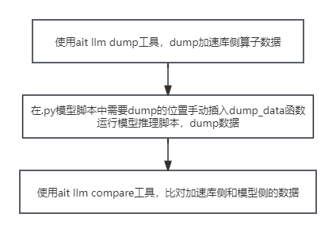

# 手动映射比对使用说明

## 使用方式

使用方式分为三步：

1. dump加速库数据。
2. 在模型脚本中手动插入工具提供的dump_data函数，运行模型推理脚本dump数据。
3. 将手动dump结束后生成的路径作为入参输入到ait llm compare中完成比对

## 第一步：dump加速库侧算子数据

### 使用方式

`ait llm dump --exec "bash run.sh patches/models/modeling_xxx.py"`

* dump默认落盘路径 `{DUMP_DIR}` 在当前目录下，如果指定 `output` 目录，落盘路径则为指定的 `{OUTPUT_DIR}`。
* `--exec` 参数是指定拉起执行大模型推理脚本的命令。

注：`{PID}`为进程号；`{TID}`为 `token_id`。

## 第二步：在模型脚本中插入dump_data

### 函数原型

`dump_data(token_id, data_id, golden_data, my_path, output_path)`

### 参数说明

| 参数名      | 说明                                                             | 是否必选 |
| ----------- | ---------------------------------------------------------------- | -------- |
| token_id    | 用于标识token的轮次                                              | 是       |
| data_id     | 数据的**唯一标识**，用于与加速库侧数据匹配，以实现数据比对 | 是       |
| golden_data | 需要dump的数据，格式为torch tensor                               | 是       |
| my_path     | 需要与dump数据作比对的加速库侧.bin文件的路径                     | 是       |
| output_path | dump数据保存的路径                                               | 否       |

### 功能说明

* 函数实现将需要 dump 的数据落盘，落盘路径为 `output_path。`
* token_id，data_id，golden_data，my_path 由用户手动指定。
* dump 默认落盘路径 `{DUMP_DIR}`在当前目录下，如果指定output目录，落盘路径则为指定的 `{OUTPUT_DIR}`。
* tensor 信息会生成在默认落盘路径的 `ait_dump/tensors/` 目录下，具体路径是 `{DUMP_DIR}/ait_dump/tensors/{PID}_{DEVICE_ID}/golden_tensor`目录下。
* `{DUMP_DIR}/ait_dump/{PID}_{DEVICE_ID}/golden_tensor` 目录下包含 dump 的数据和 `metadata.json`文件，`metadata.json` 中保存了加速库和手动 dump 数据的映射关系。

### 使用注意

* data_id是数据匹配的唯一标识，需匹配对应。
* token_id只用作数据区分不用作数据标识

### 示例

###### 1. 模型代码添加

* 在模型py文件中文件开头导入dump_data函数

  `from llm.dump.manual_dump import dump_data`
* 在需要dump比对的数据位置插入dump_data代码，5个参数由用户手动指定

  `dump_data(token_id, data_id, golden_data, my_path, output_path)`

###### 2. 运行模型推理dump数据

* `python main.py --mode precision_single --model_path xxx/ATB/ascend-speed-inference/pytorch/examples/chatglm2_6b --batch 1`

###### 3. 模型推理完成

* 模型推理脚本运行结束后会在 `{DUMP_DIR}/ait_dump/{PID}_{DEVICE_ID}/golden_tensor`目录中保存dump的数据和记录映射关系的 `metadata.json`。

## 第三步：使用ait llm compare工具比对加速库侧和模型侧的数据

### 使用方式

`ait llm compare --golden-path {DUMP_DIR}/ait_dump/{PID}_{DEVICE_ID}/ --my-path my-path.bin --output output_dir`

### 参数说明

| 参数名             | 描述                                                                                      | 是否必选 |
| ------------------ | ----------------------------------------------------------------------------------------- | -------- |
| --golden-path, -gp | 标杆数据路径，支持单个数据文件路径或文件夹，指定文件夹时路径内应该包括 `/golden_tensor` | 是       |
| --my-path, -mp     | 待比较的数据路径，为单个数据文件路径                                                      | 是       |
| --log-level, -l    | 日志级别，默认为info                                                                      | 否       |
| --output, -o       | 比较结果csv的输出路径，默认为当前路径                                                     | 否       |

### 功能说明

* ait llm compare提供有精度问题的数据与标杆数据之间的比对能力。
* --golden-path参数为第二步中 `golden_tensor`所在目录 `{DUMP_DIR}/ait_dump/{PID}_{DEVICE_ID}/`
* 完成比对后会在 `output_dir`下生成一个 `cmp_report.csv`，保存比对的最终结果。
